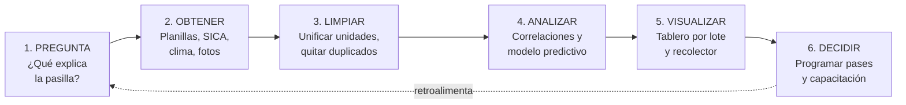

# Diagnóstico de datos de un proceso — Cosecha y beneficio del café en el Huila

**Autor:** Yilver Medina Urrea
**Usuario GitHub:** [@yilvermedina](https://github.com/yilvermedina)
**Curso:** Electiva VI · Ciencia de Datos · 2026-B · Grupo 1
**Institución:** Corporación Universitaria del Huila (CORHUILA)
**Actividad:** Corte 1 — Semana 4

---

## 1. Proceso elegido y pregunta de datos

### 1.1 Contexto

El Huila es el **primer departamento cafetero de Colombia**. Según cifras de la Federación Nacional de Cafeteros (FNC) presentadas en el Pre-Congreso Cafetero 2025, el departamento aporta el **19,65 % de la producción nacional**, con **2.523.904 sacos** de café pergamino seco, **115.818 hectáreas** cultivadas y más de **87.700 familias** que dependen de esta actividad. Su productividad es de **21,8 sacos por hectárea**, por encima del promedio nacional de 19,7.

### 1.2 El proceso a diagnosticar

Analizo el proceso de **cosecha (recolección) y beneficio del café** en una finca cafetera del Huila: desde que el fruto se recolecta hasta que el café pergamino seco se entrega al punto de compra.

Este proceso concentra las pérdidas económicas del caficultor. La investigación de Cenicafé sobre indicadores de recolección identifica cuatro problemas medibles en esta etapa:

- **Eficiencia:** frutos maduros que quedan en el árbol sin recolectar
- **Pérdidas:** frutos que caen al suelo durante la labor
- **Calidad:** frutos verdes mezclados en la cosecha
- **Tiempo:** duración real de la labor

El café verde recolectado por error se convierte en **pasilla** (grano defectuoso), que se paga a un precio mucho menor. Cada punto porcentual de pasilla es dinero que el caficultor pierde.

### 1.3 Pregunta de datos

> **¿Qué factores explican la variación del porcentaje de café defectuoso (pasilla) y de las pérdidas en recolección entre los distintos lotes y recolectores de la finca, y cómo se puede predecir el momento óptimo de pase de cosecha en cada lote para reducir esas pérdidas?**

**Sub-preguntas que se derivan:**

| # | Pregunta | Qué permite decidir |
|---|---|---|
| 1 | ¿Qué lotes concentran mayor % de pasilla? | Dónde reforzar supervisión |
| 2 | ¿El rendimiento del recolector (kg/h) se relaciona con la calidad de lo recolectado? | Cómo pagar y capacitar |
| 3 | ¿Cuántos días después de la floración conviene hacer el pase? | Cuándo cosechar |
| 4 | ¿La lluvia de los días previos afecta la calidad del secado? | Cuándo y cómo secar |

> 🔧 **Personaliza:** si conoces una finca real (familiar, de un vecino o de la región), menciónala con nombre, vereda y área aproximada. Un caso concreto puntúa mejor que uno genérico.

---

## 2. Inventario de datos

Se identifican **nueve fuentes de datos** (el mínimo exigido son seis), clasificadas según su estructura.

| # | Fuente / Campo | Descripción | Formato | Clasificación |
|---|---|---|---|---|
| 1 | **Planilla diaria de recolección** | `fecha`, `id_recolector`, `lote`, `kg_cereza`, `horas_trabajadas` | Excel / CSV | 🟩 **Estructurado** |
| 2 | **Análisis de calidad del grano** | `factor_rendimiento`, `%_pasilla`, `%_grano_verde`, `humedad` | Excel / Base de datos | 🟩 **Estructurado** |
| 3 | **Registro de la finca en SICA (FNC)** | `area_ha`, `variedad`, `edad_cultivo`, `densidad_siembra`, `altitud` | Base de datos institucional | 🟩 **Estructurado** |
| 4 | **Datos climáticos** (estación local o IDEAM) | `temperatura`, `precipitacion_mm`, `humedad_relativa`, `brillo_solar` | CSV / API | 🟩 **Estructurado** |
| 5 | **Lecturas del sensor de la báscula y del secador** | `timestamp`, `peso_kg`, `temperatura_secado` | JSON / logs | 🟨 **Semiestructurado** |
| 6 | **Precio interno de compra publicado por la FNC** | Precio diario por carga de 125 kg | JSON / HTML web | 🟨 **Semiestructurado** |
| 7 | **Facturas de insumos y comprobantes de venta** | Fertilizantes, jornales, entregas a cooperativa | PDF / XML | 🟨 **Semiestructurado** |
| 8 | **Fotografías de los lotes y de las muestras de grano** | Imágenes para evaluar madurez y defectos | JPG / PNG | 🟥 **No estructurado** |
| 9 | **Mensajes de WhatsApp y notas de voz del mayordomo** | Novedades diarias: lluvias, ausencias, plagas | Texto libre / audio | 🟥 **No estructurado** |

### Resumen de la clasificación

| Tipo | Cantidad | Fuentes |
|---|---|---|
| 🟩 Estructurado | 4 | 1, 2, 3, 4 |
| 🟨 Semiestructurado | 3 | 5, 6, 7 |
| 🟥 No estructurado | 2 | 8, 9 |
| | **9 total** | |

> 💡 **Observación:** las fuentes 8 y 9 son las más ricas en contexto pero las más difíciles de explotar. Hoy esa información se pierde porque nadie la registra de forma sistemática. Convertirla en dato aprovechable es parte del valor del proyecto.

---

## 3. Tipo de analítica y análisis de Big Data

### 3.1 Escalera de analítica aplicada al caso

| Nivel | Pregunta que responde | Aplicación en la finca | ¿Se aplica? |
|---|---|---|---|
| **Descriptiva** | ¿Qué pasó? | Kg recolectados y % de pasilla por lote y por semana | ✅ **Punto de partida** |
| **Diagnóstica** | ¿Por qué pasó? | Correlacionar pasilla con recolector, lote, clima y días desde floración | ✅ **Núcleo del trabajo** |
| **Predictiva** | ¿Qué pasará? | Estimar el % de maduración por lote para programar el próximo pase | ✅ **Meta alcanzable** |
| **Prescriptiva** | ¿Qué debo hacer? | Recomendar automáticamente qué lote cosechar cada día y con cuántos recolectores | 🎯 **Objetivo final** |

### 3.2 ¿Por qué esta ruta y no otra?

**Empiezo en descriptiva porque hoy no hay línea base.** En la mayoría de fincas la planilla de recolección se lleva en papel y nunca se consolida. Sin saber cuánta pasilla se produce por lote, no tiene sentido intentar predecir nada: se estaría modelando sobre datos que no existen.

**El mayor retorno está en la analítica diagnóstica.** El hallazgo de Cenicafé de que *no existe correlación directa entre el rendimiento del recolector y los indicadores de cosecha* es exactamente el tipo de conclusión que solo aparece cuando se cruzan datos. Contradice la creencia común de que el recolector más rápido es el mejor, y cambia la forma de pagar y supervisar.

**Lo prescriptivo es la meta, pero requiere historial.** Un modelo que recomiende qué lote cosechar necesita al menos dos o tres cosechas registradas. Es el objetivo a mediano plazo, no el entregable inmediato.

### 3.3 ¿Es este un caso de Big Data?

El concepto de las "V" proviene del informe de **Doug Laney (2001)** para META Group —hoy Gartner—, titulado *3D Data Management: Controlling Data Volume, Velocity, and Variety*, que definió las tres dimensiones originales.

Aplicando el marco con honestidad, la respuesta **depende de la escala**:

| "V" | En **una finca** | En el **Huila completo** (87.700 familias) |
|---|---|---|
| **Volumen** | ❌ Bajo. Una cosecha genera miles de filas, no millones. Cabe en Excel. | ✅ Alto. Millones de registros por cosecha, más imágenes satelitales y sensores. |
| **Velocidad** | ⚠️ Media. Datos diarios en cosecha, pero estacionales el resto del año. | ✅ Alta. Sensores, precios diarios y clima en tiempo real de miles de fincas. |
| **Variedad** | ✅ **Alta.** Es la V dominante: tablas, JSON, PDF, imágenes, audio y texto libre conviven. | ✅ Alta, con la misma heterogeneidad multiplicada. |
| **Veracidad** | ✅ **Crítica.** Planillas en papel, básculas descalibradas y reportes verbales generan errores. | ✅ Crítica y más difícil de auditar. |
| **Valor** | ✅ Alto. Cada punto de pasilla evitado es ingreso directo. | ✅ Alto a nivel de política sectorial. |

**Conclusión razonada:**

> A escala de **una finca individual NO es un caso de Big Data**. Cumple con creces las V de *variedad*, *veracidad* y *valor*, pero **no cumple volumen ni velocidad**, que son las dos dimensiones que técnicamente exigen infraestructura distribuida. Con Python, pandas y una base de datos relacional el problema se resuelve completamente.
>
> **Sí se convierte en Big Data cuando se escala al departamento**: al integrar las 87.700 familias cafeteras del Huila con imágenes satelitales, sensores de campo y series climáticas históricas, las cinco V se cumplen simultáneamente y sí se justifica arquitectura distribuida.

**Por qué esta distinción importa:** llamar "Big Data" a un problema que se resuelve con una hoja de cálculo lleva a sobredimensionar la solución, gastar en infraestructura innecesaria y fracasar en la adopción. El diagnóstico correcto de la escala es parte del diagnóstico de datos.

---

## 4. Ciclo de vida del proyecto

### Detalle de cada etapa

| Etapa | Qué se hace en este caso | Herramienta | Riesgo principal |
|---|---|---|---|
| **1. Preguntar** | Definir la pregunta de datos con el administrador de la finca, no en el escritorio | Entrevista | Preguntar algo que no se puede medir |
| **2. Obtener** | Digitalizar planillas, descargar clima del IDEAM, consultar SICA, exportar fotos | Formulario móvil, API | Que no exista registro histórico |
| **3. Limpiar** | Unificar kg vs. arrobas, corregir fechas, tratar días sin registro, eliminar duplicados de báscula | Python + pandas | **Consume el 70 % del tiempo real** |
| **4. Analizar** | Correlación entre pasilla, recolector, lote, clima y días desde floración; regresión para predecir maduración | Python, scikit-learn | Confundir correlación con causa |
| **5. Visualizar** | Tablero con semáforo por lote y ranking de calidad por recolector | Power BI / Looker Studio | Gráficos que el caficultor no entienda |
| **6. Decidir** | Programar el pase de cosecha, ajustar cuadrilla, capacitar en recolección selectiva | Reunión operativa | Que el tablero se mire y nadie actúe |

**El ciclo se retroalimenta:** los resultados de la cosecha decidida en la etapa 6 se convierten en datos nuevos para la etapa 2 de la siguiente cosecha. Cada cosecha mejora el modelo de la siguiente.

---

## 5. Problem & data

The Huila department is the largest coffee producer in Colombia, accounting for 19.65 % of national output with more than 87,700 families depending on this activity, yet most farms still record their harvest data on paper and lose it at the end of every season. The problem I want to solve is the economic loss caused by defective beans, known locally as *pasilla*, which appear when unripe cherries are mixed into the harvest or when drying conditions are poor, and this loss varies widely between plots and pickers without anyone knowing exactly why. To answer this question I need structured data such as the daily picking sheet with kilograms per picker and per plot, the laboratory quality report with the percentage of defective beans, the farm registry from the FNC information system, and local weather records of rainfall and temperature. I also need semi-structured sources such as scale sensor logs in JSON format, purchase invoices in PDF, and the daily internal coffee price published by the National Federation of Coffee Growers, together with unstructured sources such as photographs of the plots and voice messages from the farm manager reporting daily incidents. The analytics type I would apply starts as descriptive, because there is currently no baseline at all, then moves to diagnostic analytics to find which factors actually explain the variation in quality, and finally to predictive and prescriptive analytics to recommend the optimal harvesting day for each plot. This is not a Big Data case at the scale of a single farm, since volume and velocity remain low even though variety and veracity are demanding, but it does become one when the same model is scaled to the whole department.

---

## 6. Referencias

1. **Federación Nacional de Cafeteros (2025).** Cifras de producción cafetera departamental presentadas en el Pre-Congreso Cafetero 2025, Pereira. Reportadas en: Diario del Huila, *"Huila mantiene el liderazgo cafetero nacional con el 19,65 % de la producción del país"*, 13 de noviembre de 2025. Disponible en: https://diariodelhuila.com/huila-mantiene-el-liderazgo-cafetero-nacional-con-el-1965-de-la-produccion-del-pais/

2. **Laney, D. (2001).** *3D Data Management: Controlling Data Volume, Velocity, and Variety.* META Group Research Note, 6(70). Documento fundacional del concepto de las "V" del Big Data.

3. **García-Osorio, H. (2021).** *Gestión de la mano de obra y evaluación de indicadores de recolección de café en Colombia.* Revista Cenicafé, 72(2). Disponible en: https://publicaciones.cenicafe.org/index.php/cenicafe/article/view/158

4. **Federación Nacional de Cafeteros.** *Sistema de Información Cafetera (SICA) y Cédula Cafetera.* Disponible en: https://federaciondecafeteros.org/wp/cedula-cafetera/

---

*Entrega individual por GitHub · Fork del repositorio de la clase · CORHUILA 2026-B*
