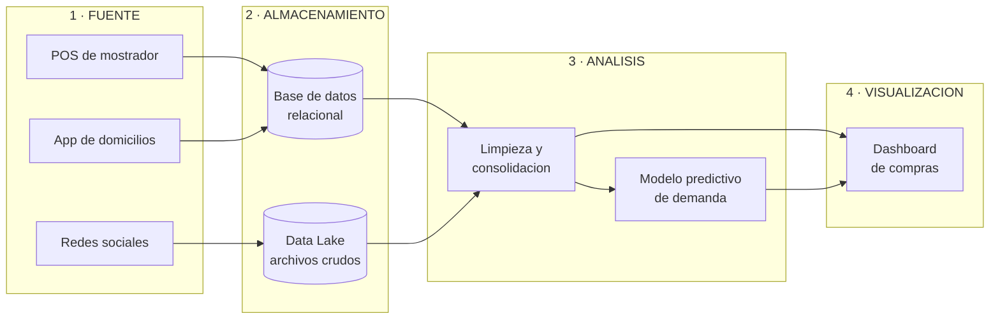

# Parcial Práctico · Corte 1

> **Asignatura:** Fundamentos de Analítica de Datos
> **Estudiante:** Yilver Medina
> **Modalidad:** Individual
> **Fecha de entrega:** 8 de septiembre de 2026
> **Repositorio:** `05-week/parcial-c1`

---

## Índice

1. [Caso de estudio](#1-caso-de-estudio)
2. [Identificación y clasificación de los datos](#2-identificación-y-clasificación-de-los-datos)
3. [Preguntas de analítica](#3-preguntas-de-analítica)
4. [Arquitectura del flujo de datos](#4-arquitectura-del-flujo-de-datos)
5. [Descriptive vs. Predictive Analytics (English)](#5-descriptive-vs-predictive-analytics-english)
6. [Conclusiones](#6-conclusiones)
7. [Checklist de cumplimiento](#7-checklist-de-cumplimiento)

---

## 1. Caso de estudio

### 1.1. La empresa

| Campo | Detalle |
|---|---|
| **Nombre** | **Nübe Coffee Lab** |
| **Sector** | Alimentos y bebidas · café de especialidad |
| **Tamaño** | Pequeña empresa · 2 puntos de venta · 11 empleados |
| **Propuesta de valor** | Café de origen tostado en el local, con carta que rota cada mes según lo que más piden los clientes |

> El nombre viene de *nube*: toda la operación del negocio (ventas, pedidos e inventario) está sincronizada en la nube, y esa es justamente la materia prima de este análisis.

### 1.2. Contexto operativo

Nübe Coffee Lab atiende alrededor de **300 clientes diarios** y vende por tres canales:

- **Mostrador**, con un sistema **POS** que registra cada transacción.
- **App de domicilios**, que envía los pedidos en archivos digitales.
- **Redes sociales** (Instagram y Google Maps), donde los clientes dejan reseñas y fotos.

Además maneja un programa de fidelización con tarjeta de puntos.

### 1.3. Problema a resolver

La administradora **compra la materia prima "a ojo"**, guiándose por la semana anterior. El resultado son dos pérdidas simultáneas:

- **Sobrestock:** días en los que sobra leche y se vence → pérdida directa de dinero.
- **Agotados:** días en los que el producto estrella se acaba a media mañana → venta perdida y cliente insatisfecho.

**Objetivo del proyecto de analítica:** usar los datos que el negocio *ya está generando* para saber cuánto comprar y cuánto personal programar cada día.

---

## 2. Identificación y clasificación de los datos

### 2.1. Tabla de clasificación

| # | Tipo de dato | Origen | Ejemplo concreto | Clasificación | Justificación técnica |
|:-:|---|---|---|:-:|---|
| **1** | Registro de ventas | Sistema POS | `fecha`, `hora`, `producto`, `cantidad`, `precio`, `medio_pago` | **Estructurado** | Esquema fijo de filas y columnas; cada campo tiene un tipo de dato definido. Se almacena en una base relacional y se consulta con SQL. |
| **2** | Maestro de clientes | Programa de fidelización | `id_cliente`, `nombre`, `correo`, `fecha_registro`, `puntos` | **Estructurado** | Formato tabular con campos delimitados e idénticos para todos los registros; admite llaves primarias y foráneas. |
| **3** | Pedidos y facturación electrónica | App de domicilios / DIAN | Archivos `JSON` y `XML` con lista anidada de productos y notas del cliente | **Semiestructurado** | No cabe en una tabla rígida (un pedido puede traer 1 o 15 ítems y campos opcionales), pero incluye **etiquetas y jerarquía** que permiten que una máquina lo interprete sin intervención humana. |
| **4** | Reseñas, comentarios y fotos | Google Maps / Instagram | *"El capuchino de la mañana estaba frío"* + fotografías de productos | **No estructurado** | Texto libre e imágenes sin formato predefinido ni campos identificables. Requiere NLP (análisis de sentimiento) o visión por computador para convertirse en información analizable. |

### 2.2. Evidencia del formato

**Dato 1 — Estructurado** (fila de la tabla de ventas):

| fecha | hora | producto | cantidad | precio | medio_pago |
|---|---|---|---|---|---|
| 2026-09-05 | 08:14 | Capuchino 12 oz | 2 | 9800 | Tarjeta |

**Dato 3 — Semiestructurado** (pedido recibido desde la app):

```json
{
  "id_pedido": "NB-20482",
  "fecha": "2026-09-05T08:14:22",
  "canal": "app_domicilios",
  "items": [
    { "producto": "Capuchino 12 oz", "cantidad": 2, "leche": "deslactosada" },
    { "producto": "Croissant", "cantidad": 1 }
  ],
  "nota_cliente": "Sin azúcar por favor",
  "total": 21300
}
```

**Dato 4 — No estructurado** (reseña publicada por un cliente):

```text
"Llegué a las 9 y ya no había croissants. Es la tercera vez que me pasa
un sábado. El café buenísimo, eso sí."   ★★★☆☆
```

### 2.3. Distribución de las fuentes

| Clasificación | Cantidad | Fuentes |
|---|:-:|---|
| Estructurados | 2 | Ventas POS · Maestro de clientes |
| Semiestructurados | 1 | Pedidos JSON / facturación XML |
| No estructurados | 1 | Reseñas, comentarios y fotos |
| **Total** | **4** | |

---

## 3. Preguntas de analítica

### 3.1. Pregunta de analítica **descriptiva**

> **¿Cuáles fueron los 5 productos más vendidos durante el último trimestre y en qué franja horaria se concentró cada uno?**

**Por qué es descriptiva:** mira exclusivamente hacia el **pasado**. Resume y organiza datos históricos que ya ocurrieron, sin estimar ningún valor nuevo. Responde a la pregunta *"¿qué pasó?"*.

**Datos que utiliza:** dato 1 (ventas POS) y dato 3 (pedidos de la app).
**Técnica:** agregaciones y agrupamientos (`GROUP BY`, sumas, conteos, promedios).

### 3.2. Pregunta de analítica **predictiva**

> **¿Cuántos litros de leche y cuántos croissants se van a necesitar el próximo sábado entre las 7:00 y las 11:00 a. m., considerando el historial de ventas, el clima y si es puente festivo?**

**Por qué es predictiva:** proyecta hacia el **futuro**. Toma los mismos datos históricos, los mete en un modelo estadístico o de machine learning y estima un valor que **todavía no ha ocurrido**. Responde a la pregunta *"¿qué va a pasar?"*.

**Datos que utiliza:** dato 1 y dato 3, enriquecidos con variables externas (clima, calendario de festivos).
**Técnica:** regresión o modelo de series de tiempo.

### 3.3. Cuadro comparativo

| Criterio | Analítica descriptiva | Analítica predictiva |
|---|---|---|
| Horizonte temporal | Pasado | Futuro |
| Pregunta que responde | ¿Qué pasó? | ¿Qué va a pasar? |
| Nivel de certeza | Hecho comprobable | Estimación con margen de error |
| Herramienta típica | SQL, tablas dinámicas, dashboards | Regresión, series de tiempo, machine learning |
| Salida en este caso | Ranking de productos por franja horaria | Litros de leche a comprar para el sábado |

---

## 4. Arquitectura del flujo de datos

### 4.1. Diagrama



### 4.2. Versión en texto (respaldo)

```text
    FUENTE                ALMACENAMIENTO             ANÁLISIS               VISUALIZACIÓN
┌────────────────┐      ┌────────────────┐      ┌──────────────────┐      ┌───────────────┐
│ POS (ventas)   │─────▶│                │      │ Limpieza y       │      │               │
│ App JSON/XML   │─────▶│ Base de datos  │─────▶│ consolidación    │─────▶│   Dashboard   │
│ Redes (texto)  │─────▶│ + Data Lake    │      │ Modelo predictivo│      │  de compras   │
└────────────────┘      └────────────────┘      └──────────────────┘      └───────────────┘
```

### 4.3. Descripción de cada etapa

| Etapa | Qué ocurre | Herramienta propuesta |
|---|---|---|
| **1 · Fuente** | Los datos se generan en el día a día del negocio: cada venta, cada pedido y cada reseña. | POS, API de la app, API de redes sociales |
| **2 · Almacenamiento** | Se centralizan. Lo estructurado y semiestructurado va a la base relacional; lo no estructurado se guarda tal cual en el data lake. | MySQL / PostgreSQL · Google Cloud Storage |
| **3 · Análisis** | Se limpian, se cruzan las fuentes y se aplican los modelos: primero el descriptivo, luego el predictivo. | Python (pandas, scikit-learn) o Excel |
| **4 · Visualización** | Los resultados se presentan en un tablero simple para que la administradora decida cuánto comprar. | Power BI / Looker Studio |

---

## 5. Descriptive vs. Predictive Analytics (English)

1. **Descriptive analytics** uses historical data to explain what has already happened in the business, for example identifying which products were the best sellers last quarter and at what time of day they were sold.

2. **Predictive analytics** goes one step further: it applies statistical models and machine learning to that same historical data in order to estimate what is likely to happen next, for example how many litres of milk the coffee shop will need on Saturday morning.

---

## 6. Conclusiones

1. Una empresa pequeña como Nübe Coffee Lab **ya genera datos de los tres tipos** sin proponérselo; el reto no es conseguirlos, sino centralizarlos y darles uso.
2. La **analítica descriptiva** convierte el historial en entendimiento del negocio: qué se vende, cuándo y a quién.
3. La **analítica predictiva** convierte ese mismo historial en una **decisión concreta y anticipada** de compra e inventario.
4. El impacto es medible: menos desperdicio de materia prima y menos ventas perdidas por agotados, sin necesidad de invertir en tecnología costosa.

---

## 7. Checklist de cumplimiento

| Requisito del enunciado | Sección | Estado |
|---|:-:|:-:|
| Identificar 4 tipos de datos y clasificarlos | 2.1 | ✅ |
| Una pregunta de analítica descriptiva | 3.1 | ✅ |
| Una pregunta de analítica predictiva | 3.2 | ✅ |
| Diagrama Fuente → Almacenamiento → Análisis → Visualización | 4.1 | ✅ |
| 2 frases en inglés sobre la diferencia | 5 | ✅ |
