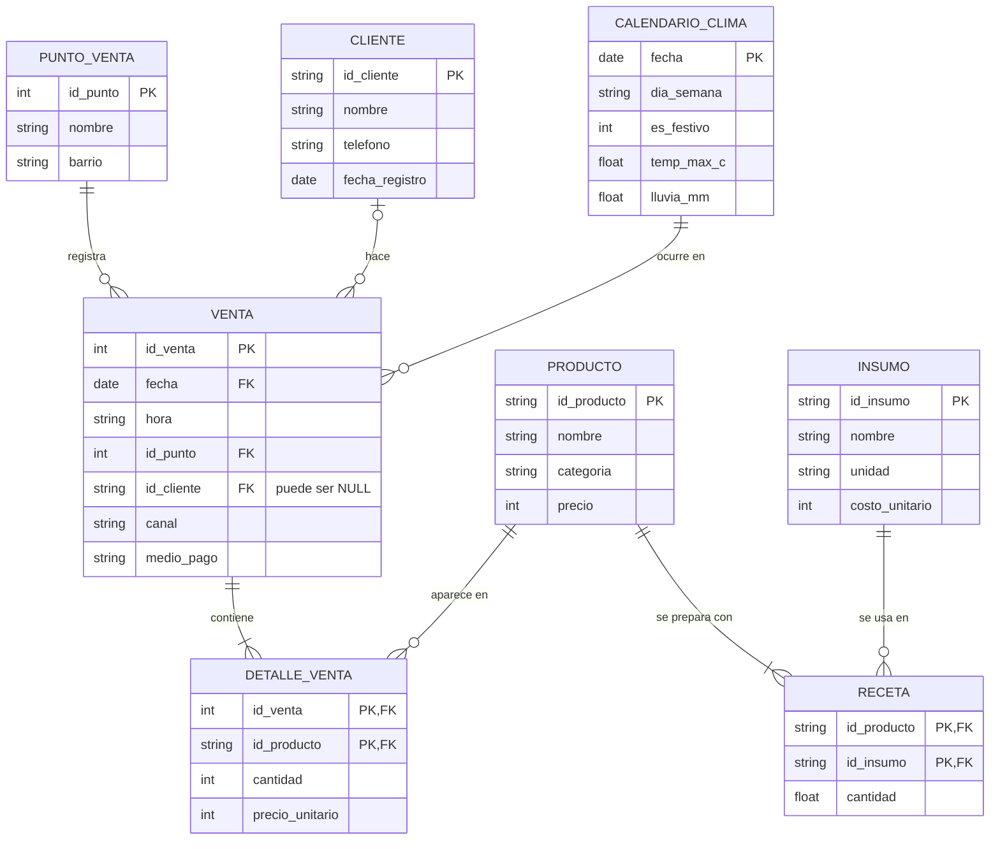

# Semana 6 · ERD de mi caso: Nübe Coffee Lab

> **Asignatura:** Ciencia de Datos · Unidad 2 — Modelamiento, transformación y conexión de datos
> **Estudiante:** Yilver Medina Urrea · [@yilvermedina](https://github.com/yilvermedina)
> **Programa:** Ingeniería Mecatrónica
> **Periodo:** 2026-B · Corte 2
> **Modalidad:** Individual

---

## 0. Recordatorio del caso

Sigo con el caso que planteé en la semana 1 y en el parcial del corte 1: **Nübe Coffee Lab**, una cafetería de especialidad en Neiva con dos puntos de venta, que hoy compra la leche, el café y los croissants "a ojo".

La pregunta de negocio es:

> **¿Cuánta materia prima debe comprar Nübe cada día de la próxima semana para que no sobre ni se agote?**

Para responderla no basta con saber *cuántos capuchinos se vendieron*. Hay que convertir cada venta en **litros de leche y gramos de café**. Por eso el modelo necesita conectar las ventas con los productos y los productos con sus insumos (la receta).

---

## 1. Diagrama entidad-relación (ERD)

*(GitHub dibuja el diagrama automáticamente porque está en Mermaid. El script SQL equivalente está en [`esquema.sql`](esquema.sql).)*

### 1.1 Entidades

| Entidad | Qué representa | PK | FK |
|---|---|---|---|
| `PUNTO_VENTA` | Cada local (Centro y El Altico) | `id_punto` | — |
| `CLIENTE` | Clientes inscritos en la tarjeta de puntos | `id_cliente` | — |
| `CALENDARIO_CLIMA` | Un registro por día: día de la semana, festivo, temperatura y lluvia | `fecha` | — |
| `VENTA` | Un ticket del POS o un pedido de domicilio | `id_venta` | `id_punto`, `id_cliente`, `fecha` |
| `DETALLE_VENTA` | Las líneas del ticket (qué producto y cuántos) | `(id_venta, id_producto)` | `id_venta`, `id_producto` |
| `PRODUCTO` | La carta: tinto, capuchino, croissant… | `id_producto` | — |
| `RECETA` | Cuánto insumo gasta una unidad de producto | `(id_producto, id_insumo)` | `id_producto`, `id_insumo` |
| `INSUMO` | Materia prima que se compra: leche, café, croissant congelado… | `id_insumo` | — |

### 1.2 Relaciones y cardinalidad

| Relación | Tipo | Lectura |
|---|---|---|
| `PUNTO_VENTA` → `VENTA` | **1:N** | Un punto registra muchas ventas; cada venta es de un solo punto. |
| `CLIENTE` → `VENTA` | **1:N (opcional)** | Un cliente puede hacer muchas compras. La venta puede no tener cliente (quien no tiene tarjeta), por eso `id_cliente` admite `NULL`. |
| `CALENDARIO_CLIMA` → `VENTA` | **1:N** | En un día hay muchas ventas. Así cada venta queda unida al clima y a si era festivo. |
| `VENTA` ↔ `PRODUCTO` | **N:M** ✅ | Un ticket tiene varios productos y un producto está en muchos tickets. Se resuelve con la tabla intermedia **`DETALLE_VENTA`**. |
| `PRODUCTO` ↔ `INSUMO` | **N:M** ✅ | Un capuchino lleva café y leche; la leche se usa en capuchino, latte, chocolate y frappé. Se resuelve con la tabla intermedia **`RECETA`**. |

Las dos relaciones N:M son la parte clave del modelo. Con ellas el consumo de leche de un día sale de una sola consulta:
**ventas del día → detalle → receta → insumo**.

---

## 2. ¿Relacional o NoSQL?

**Decisión: modelo relacional** (SQLite para el prototipo, PostgreSQL si el negocio crece).

| Criterio | En Nübe Coffee Lab | Favorece a |
|---|---|---|
| Estructura de los datos | Ventas, productos e insumos tienen siempre los mismos campos. El POS ya exporta tablas. | Relacional |
| Relaciones entre datos | El cálculo de insumos necesita cruzar 4 tablas (venta–detalle–receta–insumo). Los JOIN son el punto fuerte de SQL. | Relacional |
| Integridad | Una venta no puede tener un producto que no existe ni una cantidad de 0. Las FK y los `CHECK` lo garantizan. | Relacional |
| Transacciones | Una venta y sus líneas se guardan juntas o no se guarda nada (ACID). | Relacional |
| Volumen | ~140 tickets diarios entre los dos puntos, unos 50.000 al año. Cabe de sobra en una base relacional. | Relacional |
| Esquema flexible | Solo las **reseñas de Instagram/Google** y los JSON de la app de domicilios cambian de forma. | NoSQL |

**Conclusión:** el núcleo del negocio (ventas, inventario, recetas) es estructurado y muy relacionado, así que va en relacional. Si más adelante se quiere guardar el texto de las reseñas o los JSON crudos de la app de domicilios tal como llegan, eso sí iría bien en una colección **NoSQL documental (MongoDB)**, al lado de la base relacional y no en lugar de ella. Así quedaría una arquitectura **híbrida**: SQL para el dato operativo y NoSQL para el dato semiestructurado.

---

## 3. Dónde apliqué normalización

Parto de cómo se ve hoy la planilla que exporta el POS, todo en una sola tabla:

| fecha | hora | punto | barrio | cliente | teléfono | producto | categoría | precio | cantidad | leche_L | café_kg |
|---|---|---|---|---|---|---|---|---|---|---|---|
| 2026-08-03 | 07:15 | Nübe Centro | Centro | Laura Perdomo | 3101234567 | Capuchino | Bebida caliente | 8500 | 2 | 0,30 | 0,036 |
| 2026-08-03 | 07:15 | Nübe Centro | Centro | Laura Perdomo | 3101234567 | Croissant | Panadería | 6000 | 1 | 0 | 0 |

Problemas que tiene y cómo los resolví:

| Forma normal | Problema en la planilla | Solución en el modelo |
|---|---|---|
| **1FN** (valores atómicos, sin grupos repetidos) | Un ticket con 2 productos ocupa 2 filas que repiten fecha, hora, punto y cliente. A veces el POS los pone juntos en una celda ("Capuchino x2, Croissant"). | Separé **`VENTA`** (el encabezado del ticket) de **`DETALLE_VENTA`** (una fila por producto, con cantidad en un campo propio). |
| **2FN** (nada depende de solo una parte de la PK) | En el detalle, con PK `(id_venta, id_producto)`, el **nombre, la categoría y el precio de lista** dependen solo de `id_producto`. | Los saqué a **`PRODUCTO`**. En el detalle solo queda `precio_unitario`, que sí depende de la venta: es el precio cobrado ese día y se guarda para no perder el histórico si la carta cambia de precio. |
| **3FN** (sin dependencias transitivas) | El **barrio** depende del punto, no de la venta. El **teléfono** depende del cliente. Los **litros de leche** dependen del producto (la receta), no del ticket. | Creé **`PUNTO_VENTA`**, **`CLIENTE`** y **`RECETA`** + **`INSUMO`**. La receta se escribe **una sola vez** y no en cada venta. |
| Dato externo | El clima y los festivos se anotaban a mano en cada fila o no se anotaban. | **`CALENDARIO_CLIMA`** guarda un registro por día y se une por `fecha`. |

**Qué evité repetir:**
- El nombre y el teléfono del cliente en cada compra.
- El nombre, la categoría y el precio de lista del producto en cada línea.
- El barrio del punto en cada ticket.
- Los gramos de café y los mililitros de leche de cada bebida. Si cambia la receta del latte se corrige **una fila** de `RECETA`, no miles de ventas.
- El clima del día en cada ticket de ese día.

---

## 4. Archivos de esta entrega

| Archivo | Contenido |
|---|---|
| `README.md` | Este documento: ERD, decisión relacional/NoSQL y normalización |
| `esquema.sql` | Script `CREATE TABLE` con PK, FK y restricciones `CHECK` |

En la **semana 7** cargo datos en este mismo esquema y le hago consultas SQL.

---

*Entrega individual por GitHub · Fork del repositorio de la clase · CORHUILA 2026-B*
