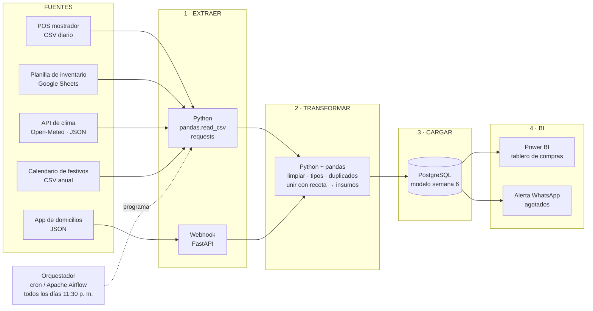

# Semana 8 · Pipeline ETL de Nübe Coffee Lab

> **Asignatura:** Ciencia de Datos · Unidad 2 — Modelamiento, transformación y conexión de datos
> **Estudiante:** Yilver Medina Urrea · [@yilvermedina](https://github.com/yilvermedina)
> **Programa:** Ingeniería Mecatrónica
> **Periodo:** 2026-B · Corte 2
> **Modalidad:** Individual

---

## 0. Qué tiene que lograr el pipeline

Cada **jueves** la administradora de Nübe Coffee Lab hace el pedido de leche, café y croissants para la semana siguiente (semana 1 del curso). El pipeline tiene que dejarle listo, antes de esa hora, un tablero con **cuánto pedir de cada insumo por día**. Para eso debe juntar las ventas de los dos puntos, los domicilios, el inventario, el clima y los festivos en la base relacional que diseñé en la semana 6.

---

## 1. Diagrama del pipeline



---

## 2. Herramienta por etapa

| Etapa | Qué hace en Nübe Coffee Lab | Herramienta | Por qué esa herramienta |
|---|---|---|---|
| **Fuentes** | POS (ventas de mostrador), app de domicilios, planilla de inventario, clima, festivos | — | Son los datos que el negocio ya genera (semana 1) |
| **1. Extraer** | Leer el CSV que exporta el POS, descargar la planilla de inventario, pedir el pronóstico a la API del clima | **Python** (`pandas.read_csv`, `requests`) | Gratis, lo vemos en clase y lee CSV, Sheets y APIs con pocas líneas. El ejemplo está en [`api_clima.py`](api_clima.py) |
| | Recibir cada pedido de domicilio en el momento en que llega | **Webhook con FastAPI** | La app de domicilios "empuja" el JSON; no hay que preguntarle a cada rato |
| **2. Transformar** | Quitar duplicados del POS, unificar nombres de productos ("capuchino", "Capuchino "), convertir fechas y precios a su tipo, aplanar el JSON de domicilios, **multiplicar cada venta por la receta** para obtener litros de leche y kg de café | **Python + pandas** | Es donde está la lógica del negocio; pandas hace limpieza y uniones (`merge`) |
| **3. Cargar** | Insertar en las tablas `venta`, `detalle_venta`, `calendario_clima`… respetando PK/FK | **PostgreSQL** (SQLite en el prototipo) | El modelo es relacional (semana 6) y las FK no dejan cargar ventas con productos que no existen |
| **4. BI** | Tablero con consumo por día, pronóstico de la semana y orden de compra sugerida | **Power BI** (o Looker Studio, gratis) | Se conecta directo a PostgreSQL y la administradora lo puede ver en el celular |
| | Aviso cuando un insumo baja del mínimo | **Alerta por WhatsApp** (API de mensajería) | Es donde la administradora ya se comunica con el equipo |
| **Orquestación** | Correr la extracción y transformación todas las noches en orden y reintentar si algo falla | **cron** al inicio, **Apache Airflow** si crece | El cron basta para una tarea diaria; Airflow da historial y reintentos |

---

## 3. ¿Qué parte es batch y qué parte es streaming?

| Flujo | Modo | Frecuencia | Por qué |
|---|---|---|---|
| Ventas del POS de mostrador | **Batch** | 1 vez al día (11:30 p. m., después del cierre) | La decisión de compra es **semanal**. No sirve de nada tener la venta del capuchino en el tablero un segundo después; basta con tener el día completo al cierre. Además el POS exporta un CSV por día. |
| Planilla de inventario y mermas | **Batch** | 1 vez al día | Se diligencia a mano al cierre del turno. |
| Pronóstico del clima | **Batch** | 1 vez al día | El pronóstico cambia poco en el día. Una llamada diaria a la API alcanza y no se gasta cuota. |
| Calendario de festivos | **Batch** | 1 vez al año | Se conoce con anticipación. |
| Pedidos de domicilio | **Streaming** (micro) | Cada pedido, al llegar | El domicilio sí tiene que verse en el momento: si en una tarde de lluvia entran 20 pedidos de chocolate seguidos, la cocina y la alerta de leche deben saberlo **antes** de que se acabe, no al otro día. |
| Alerta de insumo bajo | **Streaming** (evento) | Cuando se cruza el mínimo | Es una reacción a algo que está pasando ahora mismo. |

**Conclusión:** el pipeline es **principalmente batch**, porque responde una pregunta semanal (cuánto comprar) y el volumen es bajo (unos 140 tickets diarios). Solo los **domicilios y la alerta de agotados** van en streaming, porque ahí el valor está en reaccionar durante el día. Montar todo en streaming (con Kafka, por ejemplo) sería sobredimensionar la solución. Es el mismo error que señalé en la semana 4 de llamar "Big Data" a un problema que cabe en una hoja de cálculo.

---

## 4. (Opcional) Consumir una API pública con `requests`

El script [`api_clima.py`](api_clima.py) hace el paso **Extraer** de la fuente de clima. Consulta la API pública **Open-Meteo** (no necesita clave) para Neiva y muestra 3 registros del pronóstico:

```python
import requests
import pandas as pd

URL = "https://api.open-meteo.com/v1/forecast"
PARAMS = {
    "latitude": 2.9273, "longitude": -75.2819,          # Neiva
    "daily": "temperature_2m_max,precipitation_sum",
    "timezone": "America/Bogota", "forecast_days": 7,
}

resp = requests.get(URL, params=PARAMS, timeout=15)
resp.raise_for_status()
diario = resp.json()["daily"]

clima = pd.DataFrame({
    "fecha": diario["time"],
    "temp_max_c": diario["temperature_2m_max"],
    "lluvia_mm": diario["precipitation_sum"],
})
print(clima.head(3))
```

Para correrlo:

```bash
pip install requests pandas
python api_clima.py
```

Imprime el código HTTP (200), las claves del JSON y **3 registros** con fecha, temperatura máxima y lluvia en Neiva, y guarda el pronóstico en `clima_neiva_pronostico.csv` como área de staging para el paso Transformar.

---

## 5. Archivos

| Archivo | Contenido |
|---|---|
| `README.md` | Diagrama del pipeline, herramientas por etapa y justificación batch/streaming |
| `api_clima.py` | Consumo de la API de clima con `requests` (3 registros) |

---

*Entrega individual por GitHub · Fork del repositorio de la clase · CORHUILA 2026-B*
