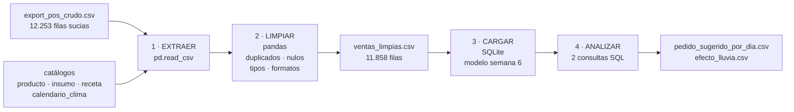
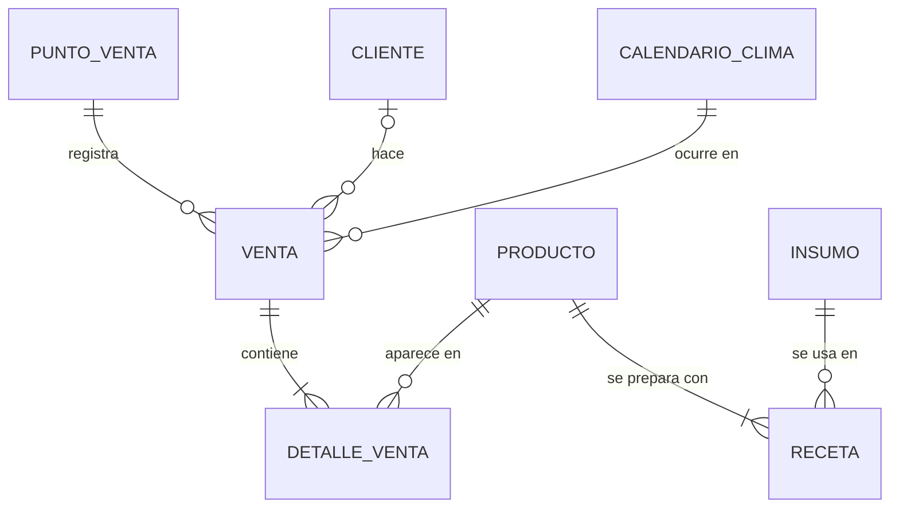

# Semana 10 · Mini-proyecto de datos (cierre del corte 2): Nübe Coffee Lab

> **Asignatura:** Ciencia de Datos · Unidad 2 — Modelamiento, transformación y conexión de datos
> **Estudiante:** Yilver Medina Urrea · [@yilvermedina](https://github.com/yilvermedina)
> **Programa:** Ingeniería Mecatrónica
> **Periodo:** 2026-B · Corte 2
> **Modalidad:** Individual

---

## 0. Resumen

En este mini-proyecto junto todo lo del corte 2 sobre mi caso, **Nübe Coffee Lab**:

| Semana | Lo que hice | Cómo lo uso aquí |
|---|---|---|
| 6 | Modelo de datos (ERD) | Es el esquema donde cargo los datos limpios ([`esquema.sql`](esquema.sql)) |
| 7 | Consultas SQL y pandas | Las 2 preguntas finales se responden con SQL (filtro + agregación) |
| 8 | Pipeline ETL | Este script es ese pipeline en pequeño: extraer → limpiar → cargar → analizar |
| 9 | Calidad de datos | La limpieza de la planilla del POS |

**Pregunta de negocio (desde la semana 1):** *¿cuánta materia prima debe comprar Nübe para cada día de la próxima semana?*

Todo corre con un solo comando:

```bash
cd 10-week
python mini_proyecto.py
```

> ⚠️ Los datos son **simulados** a partir de los de la semana 7, con semilla fija. [`simular_export_pos.py`](simular_export_pos.py) crea la planilla del POS **con errores a propósito** (duplicados, vacíos, nombres mal escritos, fechas y precios en otro formato), como queda una planilla que digitan varios cajeros.

---

## 1. Flujo documentado



### 1.1 Modelo de datos (de la semana 6)



`DETALLE_VENTA` (venta ↔ producto) y `RECETA` (producto ↔ insumo) son las tablas intermedias de las dos relaciones **N:M**. Con la receta, cada venta se convierte en litros de leche y kilos de café.

---

## 2. Extraer

Se lee `data/export_pos_crudo.csv` **todo como texto** (`dtype=str`). Así pandas no adivina tipos y se ven los problemas tal como vienen:

| Columna | Problema encontrado | Ejemplo |
|---|---|---|
| `producto` | 29 escrituras distintas para 8 productos | `capuchino`, `CAPUCHINO`, `Capuccino`, `Croisant` |
| `punto` | 8 escrituras para 2 puntos | `centro`, `NUBE CENTRO`, `Nube Centro ` |
| `fecha` | Dos formatos | `2026-08-31` y `31/08/2026` |
| `precio_unitario` | Texto con `$` y punto de miles; vacíos | `$8.500` |
| `cantidad` | Texto con unidad; vacíos; ceros | `2 und`, `0` |
| `medio_pago` | Mayúsculas mezcladas; vacíos | `NEQUI`, `Nequi` |
| (fila completa) | Filas repetidas | 357 duplicados |

> `id_cliente` vacío **no es un error**: es la venta a un cliente que no tiene tarjeta de puntos. Por eso no se imputa y no se cuenta como nulo.

---

## 3. Limpiar (pandas)

| Paso | Qué hice | Decisión |
|---|---|---|
| 2.1 Duplicados | `drop_duplicates()` | **357** filas eliminadas |
| 2.2 Producto | Quitar tildes, espacios y mayúsculas, y mapear a los nombres de la carta (con un diccionario para los errores de digitación) | 29 → **8** productos, ninguno sin reconocer |
| 2.3 Punto | Si contiene "centro" → Nübe Centro; si contiene "altico" → Nübe Altico | 8 → **2** puntos |
| 2.4 Medio de pago | `str.capitalize()`; vacíos → `"Sin dato"` | No se inventa el medio de pago |
| 2.5 Fecha | Parsear `aaaa-mm-dd` y luego `dd/mm/aaaa` | **1.447** fechas corregidas, 0 inválidas |
| 2.6 Precio | Quitar `$` y `.` → número; vacíos → precio de la carta | **225** precios imputados |
| 2.7 Cantidad | Sacar el número de `"2 und"`; vacíos → moda (1); **0 → eliminar** | 100 imputadas, 38 filas eliminadas (una cantidad 0 no es una venta) |
| 2.8 Tipos | `id_venta`, `cantidad`, `precio` → enteros; `fecha` → fecha | Listos para SQL |
| 2.9 Verificación | `(id_venta, producto)` debe ser único, porque es la PK de `detalle_venta` | ✅ se cumple |

### Antes / después

| Indicador | Antes | Después |
|---|---:|---:|
| Filas | 12.253 | **11.858** |
| Celdas vacías (sin contar `id_cliente`) | 598 | **0** |
| Filas duplicadas | 357 | **0** |
| Productos distintos | 29 | **8** |
| Puntos de venta distintos | 8 | **2** |

**Resultado de la carga en SQLite:** 7.665 ventas y 11.858 líneas de detalle. La revisión de llaves foráneas (`PRAGMA foreign_key_check`) **no encontró errores**. Hay 11 tickets menos que en el origen porque todas sus líneas tenían cantidad 0.

---

## 4. Analizar: 2 preguntas con SQL

### Pregunta 1 · ¿Cuánta leche y café hay que pedir para cada día de la semana?

```sql
WITH consumo_dia AS (                      -- consumo de cada insumo en cada fecha
    SELECT v.fecha, c.dia_semana, i.nombre AS insumo, i.unidad,
           SUM(d.cantidad * r.cantidad) AS consumo
    FROM venta v
    JOIN detalle_venta    d ON d.id_venta    = v.id_venta
    JOIN receta           r ON r.id_producto = d.id_producto
    JOIN insumo           i ON i.id_insumo   = r.id_insumo
    JOIN calendario_clima c ON c.fecha       = v.fecha
    WHERE i.nombre IN ('Leche entera', 'Café en grano')   -- filtro
      AND c.es_festivo = 0                                 -- los festivos se planean aparte
    GROUP BY v.fecha, c.dia_semana, i.nombre, i.unidad
)
SELECT dia_semana, insumo, unidad,
       ROUND(AVG(consumo), 2)        AS promedio,          -- agregación
       ROUND(MAX(consumo), 2)        AS maximo,
       ROUND(AVG(consumo) * 1.10, 1) AS pedido_sugerido    -- promedio + 10 % de seguridad
FROM consumo_dia
GROUP BY dia_semana, insumo, unidad;
```

| Día | Leche: promedio (L) | Leche: máximo (L) | **Leche: pedir (L)** | Café: promedio (kg) | **Café: pedir (kg)** |
|---|---:|---:|---:|---:|---:|
| Lunes | 17,95 | 21,21 | **19,7** | 2,28 | **2,5** |
| Martes | 17,75 | 23,00 | **19,5** | 2,28 | **2,5** |
| Miércoles | 17,42 | 20,71 | **19,2** | 2,36 | **2,6** |
| Jueves | 20,65 | 25,13 | **22,7** | 2,56 | **2,8** |
| Viernes | 21,58 | 24,82 | **23,7** | 2,80 | **3,1** |
| Sábado | 27,08 | 32,56 | **29,8** | 3,48 | **3,8** |
| Domingo | 23,49 | 26,71 | **25,8** | 2,94 | **3,2** |
| **Semana** | | | **≈ 160 L** | | **≈ 20,5 kg** |

**Respuesta:** esta tabla ya es la **orden de compra**. El sábado se gasta **un 55 % más de leche** que un miércoles, así que pedir lo mismo todos los días (como se hace hoy "a ojo") hace que sobre leche entre semana y falte el fin de semana. Le sumé un 10 % de seguridad al promedio. Para los festivos, como el 7 y el 17 de agosto, conviene pedir como un sábado.

### Pregunta 2 · ¿La lluvia aumenta la venta de bebidas calientes?

```sql
WITH por_dia AS (
    SELECT v.fecha,
           CASE WHEN c.lluvia_mm > 0 THEN 'Con lluvia' ELSE 'Sin lluvia' END AS clima,
           SUM(CASE WHEN p.categoria = 'Bebida caliente' THEN d.cantidad ELSE 0 END) AS calientes,
           SUM(CASE WHEN p.categoria = 'Bebida fría'     THEN d.cantidad ELSE 0 END) AS frias,
           COUNT(DISTINCT CASE WHEN v.canal = 'Domicilio' THEN v.id_venta END)       AS domicilios
    FROM venta v
    JOIN detalle_venta    d ON d.id_venta    = v.id_venta
    JOIN producto         p ON p.id_producto = d.id_producto
    JOIN calendario_clima c ON c.fecha       = v.fecha
    WHERE c.es_festivo = 0                                 -- filtro
    GROUP BY v.fecha, clima
)
SELECT clima, COUNT(*) AS dias,
       ROUND(AVG(calientes), 1)  AS bebidas_calientes_dia,  -- agregación
       ROUND(AVG(frias), 1)      AS bebidas_frias_dia,
       ROUND(AVG(domicilios), 1) AS domicilios_dia
FROM por_dia
GROUP BY clima;
```

| Clima | Días | Bebidas calientes / día | Bebidas frías / día | Domicilios / día |
|---|---:|---:|---:|---:|
| Con lluvia | 7 | **206,1** | 5,9 | **55,4** |
| Sin lluvia | 47 | 165,1 | 18,7 | 24,5 |

**Respuesta:** sí. Los días de lluvia se venden **un 25 % más de bebidas calientes** (206 contra 165), los frappés casi desaparecen y los **domicilios se duplican** (55 contra 25). Por eso el pipeline de la semana 8 trae el pronóstico del clima: si viene una semana lluviosa, hay que pedir más leche y chocolate, menos hielo, y reforzar los domicilios.

> Ojo: solo hubo 7 días de lluvia en las 8 semanas. La diferencia es grande, pero con más meses de datos la conclusión sería más firme.

---

## 5. Datos listos para analizar

La carpeta `datos_limpios/` queda lista para el siguiente corte (modelo predictivo):

| Archivo | Contenido |
|---|---|
| `ventas_limpias.csv` | 11.858 líneas de venta limpias, con tipos correctos |
| `reporte_antes_despues.csv` | Indicadores de calidad antes y después |
| `pedido_sugerido_por_dia.csv` | Resultado de la pregunta 1 |
| `efecto_lluvia.csv` | Resultado de la pregunta 2 |

---

## 6. Archivos de la entrega

| Archivo | Contenido |
|---|---|
| `README.md` | Este documento |
| `mini_proyecto.py` | Pipeline completo: extraer → limpiar → cargar → analizar |
| `simular_export_pos.py` | Crea la planilla sucia del POS a partir de los datos de la semana 7 |
| `esquema.sql` | Modelo relacional de la semana 6 |
| `data/` | Planilla cruda y catálogos |
| `datos_limpios/` | Salidas del proyecto |

---

*Entrega individual por GitHub · Fork del repositorio de la clase · CORHUILA 2026-B*
